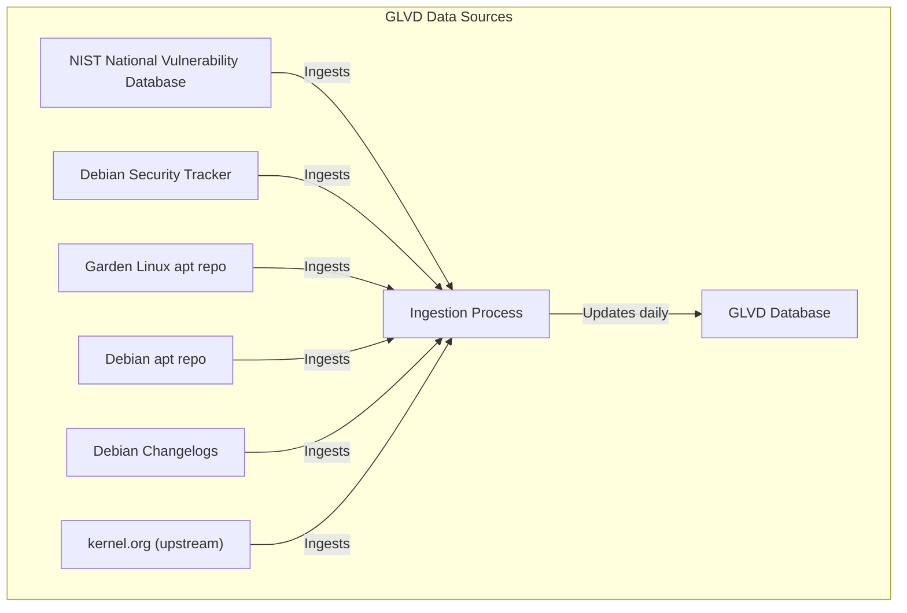

# Garden Linux Vulnerability Database - Data Ingestion

This repository contains the code for gathering data needed by [Garden Linux Vulnerability Database (glvd)](https://github.com/gardenlinux/glvd).

## Data Sources

GLVD aggregates vulnerability data from multiple trusted sources to provide comprehensive and up-to-date information. The primary sources include:

- **NIST National Vulnerability Database (NVD):** A widely recognized repository of standardized vulnerability information.
- **Debian Security Tracker:** The authoritative source for security issues affecting Debian packages.
- **Debian and Garden Linux apt repo:** Information on which packages exist in a given version of Garden Linux or Debian.
- **Debian Package Changelogs:** These logs offer insights into security fixes and updates directly from package maintainers.
- **kernel.org:** The official source for Linux kernel-specific CVEs and related security advisories.
- **CVE Triage Data from the Garden Linux Team:** Expert-reviewed data curated specifically for Garden Linux.

The code for importing from those sources is located in the `src/glvd` directory.

The following diagram illustrates how GLVD collects and processes vulnerability data from various trusted sources.



## Kubernetes Ingestion Cron Job

In Kubernetes environments, data ingestion is automated using a cron job. This ensures the cluster's database is kept up-to-date on a regular schedule.

The cron job uses the container image built by the "01 - Build and Push Data Ingestion Container" workflow.
The cron job configuration can be found [here](https://github.com/gardenlinux/glvd/blob/main/deployment/k8s/02_ingestion-job.yaml).
This setup helps maintain current vulnerability data in your GLVD database with minimal manual intervention.

## Data Ingestion GitHub Actions workflows

There are [multiple useful workflows](https://github.com/gardenlinux/glvd-data-ingestion/actions/) to make it more simple to work with the ingestion process.

The workflows are numbered to make it more clear what depends on what.

On push, only "01 - Build and Push Data Ingestion Container" is ran automatically.
The other workflows need to be run on demand.

Those workflows exist in this repo:

#### 01 - Build and Push Data Ingestion Container

This workflow builds and pushes the container where the ingestion is running.
This container is used in the "Dump GLVD Postgres Snapshot to sql file" workflows, and in the cronjob mentioned above.

#### 02 - Dump GLVD Postgres Snapshot to sql file

This workflow runs a full ingestion job from scratch and exports a postgres dump file which can be imported.
This dump is used to create working glvd instances quickly.
It is possible to run the full ingestion process locally, but this takes time and is error prone.

This workflow runs on schedule to keep an updated dump of the glvd database available at all times.

#### 02.5 - Dump GLVD Postgres Snapshot to sql file (incremental)

This workflow is the same as "02 - Dump GLVD Postgres Snapshot to sql file", but it uses a previous dump if that exists which makes it much faster to run.
Note that this workflow fails if no current dump is available from the 02 job.

#### 03 - Build and Push Container to init GLVD Postgres DB

This workflow builds and pushes the `gardenlinux/glvd-init` container image which is used both in the local Compose setup and in the cluster setup to fill the database with the dump that was created in "02 - Dump GLVD Postgres Snapshot to sql file".

#### 03.5 - Build and Push Container to init GLVD Postgres DB (Incremental)

Same as above but makes use of "02.5 - Dump GLVD Postgres Snapshot to sql file (incremental)".

#### 97 - Generate Source Manifests

This workflow generates text files containing a list of source packages in a specific Garden Linux image.
This is required for [the image-based view](https://github.com/gardenlinux/glvd/issues/189).
It has to be run for new releases of Garden Linux.

#### 98 - Build and Push Changelogs Downloader Container

Builds and pushes a container image for downloading debian changelog files.
Needed for [addressing a class of false positive findings in glvd](https://github.com/gardenlinux/glvd/issues/149).

#### 99 - Test Data Ingestion Container

Workflow to test/debug the container built in "01 - Build and Push Data Ingestion Container".


## Containerfiles

This repository provides several container images for different development, testing, and operational tasks.  
Below is a summary of each `Containerfile` and its intended use:

### **Containerfile**
The main container for data ingestion.  
- Installs all dependencies required to run the GLVD data ingestion pipeline.
- Used for production ingestion jobs and as the base for most workflows.
- This container is built and published using workflow "01 - Build and Push Data Ingestion Container"

> **ℹ️ Note:**  
> This container is part of GLVD releases—there is a **tagged image for each release**.
> Find the images [here](https://github.com/gardenlinux/glvd-data-ingestion/pkgs/container/glvd-data-ingestion).

### **Containerfile.pg-init**
Initializes a PostgreSQL database for GLVD.
- Installs the PostgreSQL client.
- Loads the database schema and initial data from a SQL file.
- Used for local development and to quickly bootstrap live clusters.

> **ℹ️ Note:**  
> This container is part of GLVD releases—there is a **tagged image for each release**.
> Find the images [here](https://github.com/gardenlinux/glvd-data-ingestion/pkgs/container/glvd-init).

### **Containerfile.unit-tests**
A container for running Python unit tests.
- Installs all Python dependencies and `pytest`.
- Entry point runs the test suite.

Unit tests can also be run without this container by running 

```bash
source .venv/bin/activate
./unit-tests.sh
```

There are also **integration tests** which can be run via

```bash
# In one terminal, build and run the database for the integration tests
cd tests/integration/db
make && make run

# In another terminal, run the tests
source .venv/bin/activate
./integration-tests.sh
```

### **Containerfile.pg-formatter**
Provides the [pgFormatter](https://github.com/darold/pgFormatter) tool for formatting SQL files.
- Used to automatically format and lint SQL schema and migration files.
- Simply run `format-sql-schema.sh`, which builds and runs this container for you.

### **Containerfile.debug**
A debug/development container for interactive testing.
- Installs extra tools and all Python dependencies.
- Useful for manual debugging and development inside the container.

Can be used with `compose.yaml` to bring up da development environment

```
podman compose --file compose.yaml up
podman exec -it glvd-data-ingestion-ingest-1 bash
```

Sample command to run inside the container:

```
python3 -m glvd.cli.data
python3 -m glvd.cli.data.ingest_kernel /vulns/cve/published/ --debug
python3 -m glvd.cli.data.ingest_changelogs 1592.7
```

### **Containerfile.changelog-downloader**
Builds a minimal container for downloading Debian changelog files.
- Installs only the required Python dependencies.
- Runs the changelog download script.
- Used in the workflow for changelog ingestion and false positive reduction.

### **Containerfile.apt-source**
Builds a container for downloading and extracting the apt sources index file.
This file is used to determine the available packages in a Garden Linux version.
- Based on a Garden Linux image.
- Installs `lz4` and prepares the apt sources index.
- Used for generating package lists for debsrc ingestion.

Download the apt sources index file with the help of this container image:

```bash
podman build -t sources-index-downloader -f Containerfile.apt-source
podman run localhost/sources-index-downloader:latest > package-list
```

With this file, you can run the debsrc parser like so:

```bash
python -m venv venv
source venv/bin/activate
poetry install
python3 -m glvd.data.debsrc package-list
```

### Run ingestion locally

#### Database setup

```bash
podman network create glvd
podman run -it --rm --name=glvd-postgres --network=glvd --publish 5432:5432 --env POSTGRES_USER=glvd --env POSTGRES_DB=glvd --env POSTGRES_PASSWORD=glvd ghcr.io/gardenlinux/glvd-postgres:latest
podman run -it --rm --network=glvd --env PGHOST=glvd-postgres ghcr.io/gardenlinux/glvd-init:latest
```


Configure the postgres db credentials (`PG..` env vars)


```bash
export PGUSER=glvd
export PGDATABASE=glvd
export PGPASSWORD=glvd
export PGHOST=localhost
export PGPORT=5432
```

#### Run ingestion

```bash
python -m venv venv
source venv/bin/activate
poetry install
python3 -m glvd.cli.data.ingest_debsrc gardenlinux today path/to/package-list
python3 -m glvd.cli.data.ingest_nvd
```

(Replace `today` with the version, like `1443`)

## Import source packages

```bash
kubectl -n glvd run source-manifest-import$RANDOM --restart='Never' --image=ghcr.io/gardenlinux/glvd-data-ingestion:latest --env=DATABASE_URL=postgres://glvd:$(kubectl -n glvd get secret/postgres-credentials --template="{{.data.password}}" | base64 -d)@glvd-database-0.glvd-database:5432/glvd -- python3 /usr/local/src/src/glvd/import-source-manifest.py --manifest-dir=/usr/local/src/data/sourcemanifests/
```

## Copyright Notice

This project ships the following 3rd party software:

[nalanj/migrations](https://github.com/nalanj/migrations), Copyright nalanj under the MIT License

Affecting the following files:

- `bin/migrate-all`
- `bin/migrate`
- `schema/000-bootstrap.sql`
